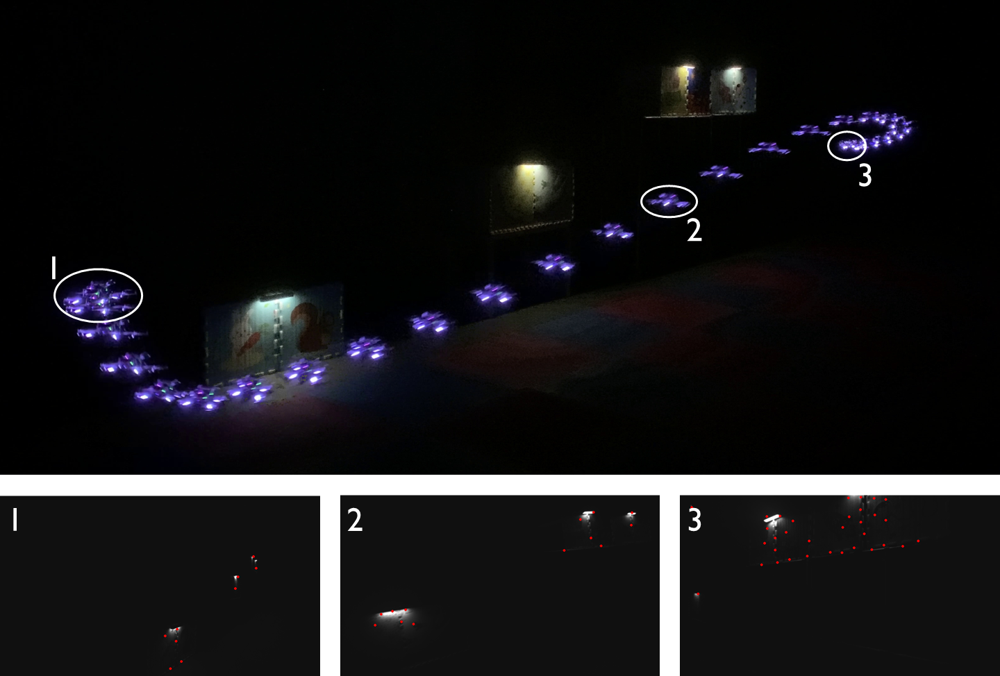

# APACE
<div align="center">
    
</div>
<div align="center">
<a href="https://arxiv.org/abs/2403.08365">

</a>
<a href="https://youtu.be/FIM3ta6p_d0">

</a>
<a href="https://www.bilibili.com/video/BV1sC4y1Z7Ps">

</a>
</div>

This is the code repository for the paper contributed to ICRA2024: 
*APACE: Agile and Perception-aware Trajectory Generation for Quadrotor Flights*.

**APACE** is a systematic, flexible and efficient framework for **A**gile and **P**erception-**A**ware traje**C**tory g**E**neration for quadrotor flights.
**APACE** empowers a quadrotor with visual sensors to maneuver in challenging environments while maintaining stable visual odometry, such as in a darkness scenario with only a few light spots.

<div align="center">

</div>

Please cite our paper if you use this project in your research:
- [__APACE: Agile and Perception-Aware Trajectory Generation for Quadrotor Flights__](https://arxiv.org/abs/2403.08365), Xinyi Chen, Yichen Zhang, Boyu Zhou, and Shaojie Shen, 2024 IEEE International Conference on Robotics and Automation (ICRA2024).

```
@article{chen2024apace,
  title={APACE: Agile and Perception-Aware Trajectory Generation for Quadrotor Flights},
  author={Chen, Xinyi and Zhang, Yichen and Zhou, Boyu and Shen, Shaojie},
  journal={arXiv preprint arXiv:2403.08365},
  year={2024}
}
```

Please kindly star :star: this project if it helps you. Thanks for your support! :sparkling_heart:

## Getting Started

The setup commands have been tested on Ubuntu 20.04 (ROS Noetic). If you are using a different Ubuntu distribution, please modify accordingly.

* Install dependency and clone the repository
  ```
    sudo apt install libgoogle-glog-dev libdw-dev
    cd ${YOUR_WORKSPACE_PATH}/src
    git clone https://github.com/HKUST-Aerial-Robotics/APACE.git
    git clone https://github.com/xchencq/VINS-Fusion.git
    cd ..
    catkin_make
    source devel/setup.bash
  ```
* Download the [map files](https://drive.google.com/drive/folders/1IPUBSd-ACf_wFpIpqLQSaWH9s2awQ6-f?usp=sharing) from Google Drive and put them in the `APACE/voxel_mapping/data` folder.

* Download the [pre-built AirSim simulator package](https://drive.google.com/file/d/1wUkvFrmSaT2qL5vDpH49VlWv2G_kEluU/view?usp=sharing) and the [Airsim library](https://drive.google.com/file/d/1rBClGuj98AnOjyl6V00V5X-BWr4BqbrQ/view?usp=sharing) utilized in our experiments from Google Drive. You can put them in any directory you like and remember to extract them. For example, you may put them in a folder `~/source`.

* Build the AirSim library
  ```
    cd ~/source/AirSim_source
    ./setup.sh
    ./build.sh
  ```

* Move the `settings.json` file from the repository to `~/Documents/AirSim` folder and replace the original one.

* Setup the AirSim root as the directory path of the `AirSim_source` folder in the beginning of `APACE/airsim_ros_wrapper/CMakeLists.txt`.

## Run
After successful installation, you can run the APACE planner in the AirSim simulator.

<div align="center">
  
</div>

* Launch RViz visualization
  ``` 
    roslaunch plan_manage rviz.launch
  ```
* Launch pre-built AirSim simulator, e.g. under ~/source folder
  ``` 
    ~/source/CenterFeature/LinuxNoEditor/AirSimStreetView.sh -windowed
  ```
* Launch AirSim ROS wrapper 
  ``` 
    roslaunch airsim_ctrl ctrl_md_exploration.launch
  ```
* Launch VINS estimator
  ``` 
    roslaunch vins vins_airsim.launch
  ```
* Launch APACE planner
  ```
    roslaunch plan_manage agile_planner_airsim.launch
  ```