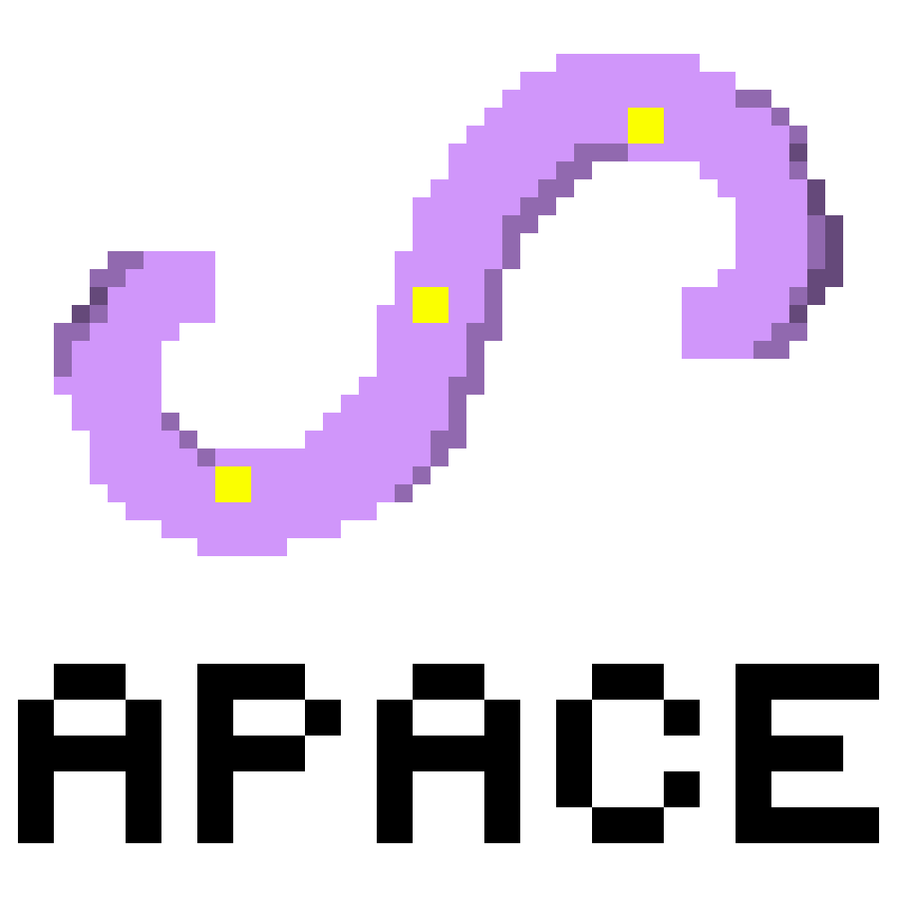

# APACE

    

This is the code repository for the paper contributed to ICRA2024: *APACE: Agile and Perception-aware Trajectory Generation for Quadrotor Flights*.

**APACE** is a systematic, flexible and efficient framework for **A**gile and **P**erception-**A**ware traje**C**tory g**E**neration for quadrotor flights, which takes feature matchability into account.

:turtle: We are diligently working on organizing the code, which will be made available before the ICRA conference in May 2024. Please stay tuned!
